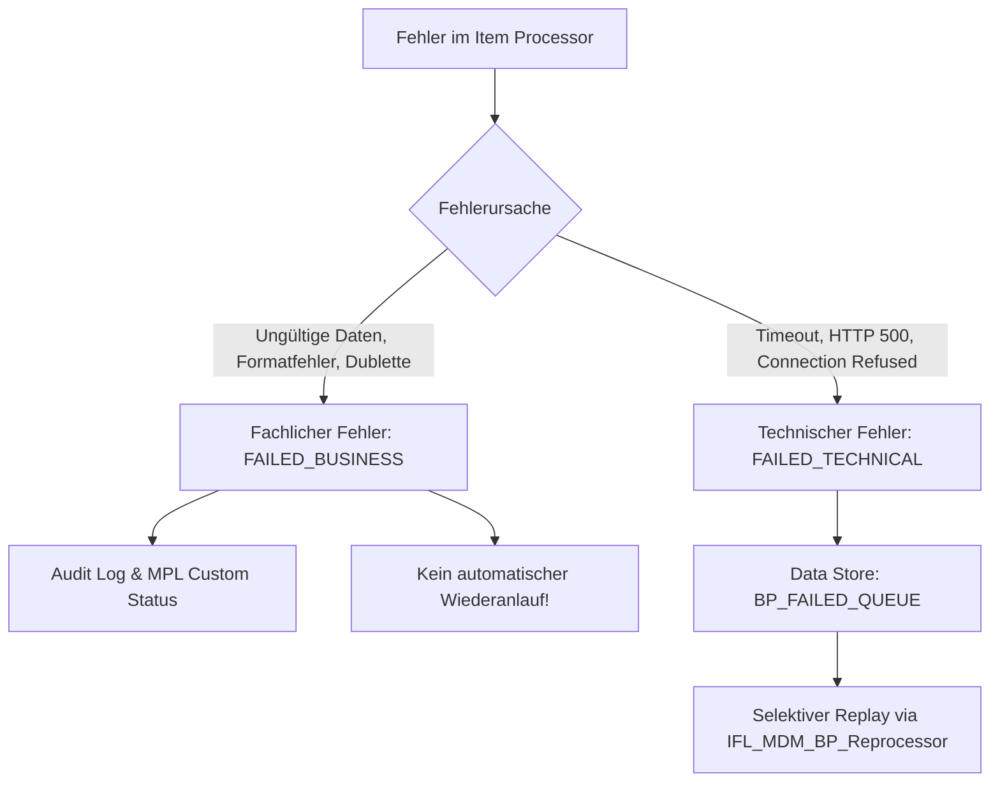

# Resilienz & Dead-Letter-Behandlung

## Dual-Channel Fehlerbehandlung
In Enterprise-Schnittstellen dürfen fachliche Datenfehler niemals dieselbe Fehlerbehandlung wie technische Netzwerkausfälle durchlaufen:

## Fachliche Fehler (Non-Retryable)
- **Ursachen:** Fehlende `externalId`, ungültige E-Mail-Syntax, Land nicht ISO-2, Mehrfachtreffer im OData GET.
- **Behandlung:** Sofortige Protokollierung in den Message Attachments (`Validation_Errors.txt`), Status `FAILED_BUSINESS`. Ein erneutes automatisches Senden ist sinnlos, da der Fehler in den Daten liegt.

## Technische Fehler (Retryable)
- **Ursachen:** Timeout gegen S/4HANA, HTTP 503 Service Unavailable, Netzwerkunterbrechung.
- **Behandlung:** Der Original-Payload des Einzelsatzes wird als Eintrag in der persistenten Data Store Queue `BP_FAILED_QUEUE` gesichert.
- **Vorteil:** Nach Beseitigung der Störung kann der Satz einzeln verarbeitet werden, ohne den gesamten Batch erneut aus dem MDM anfordern zu müssen.
